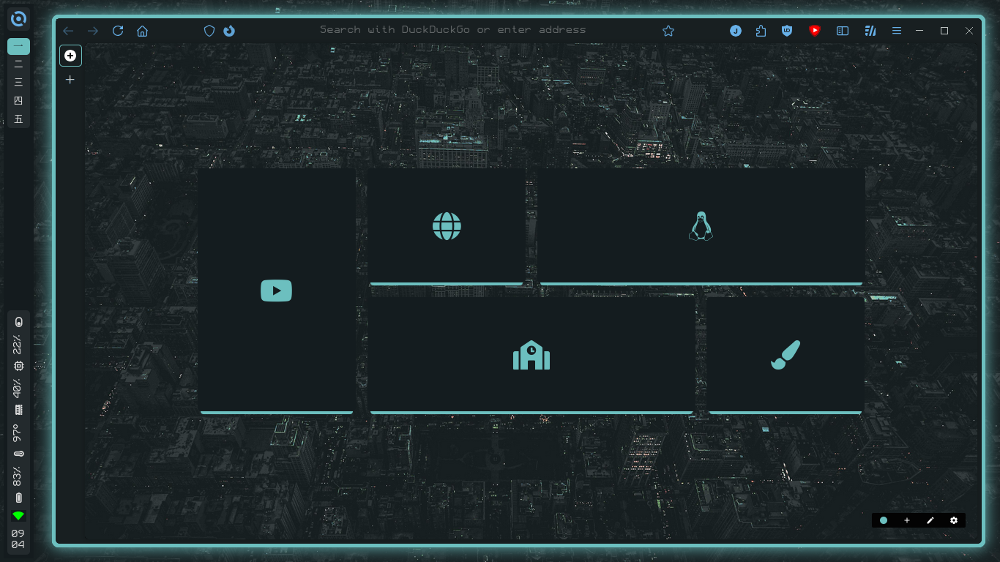
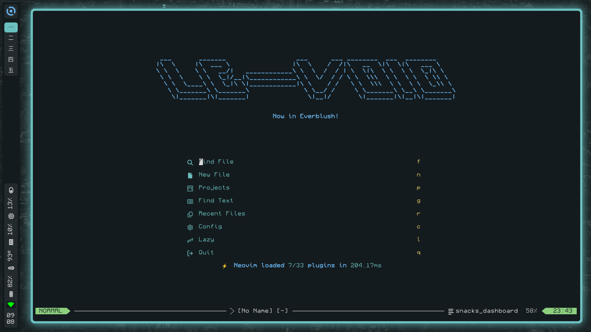
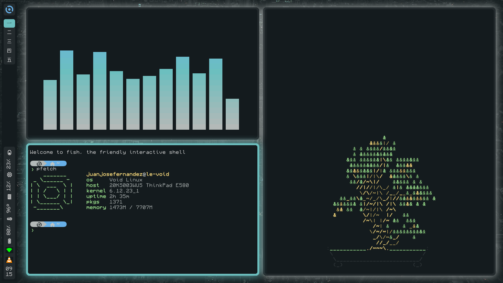
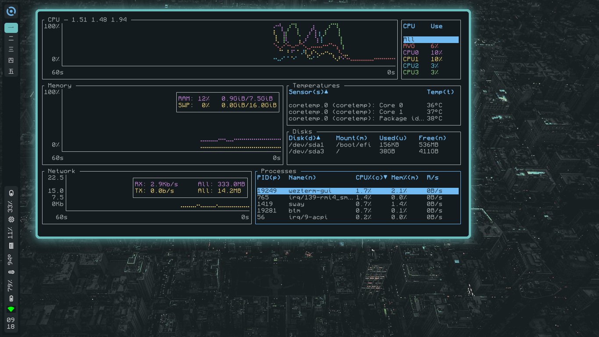
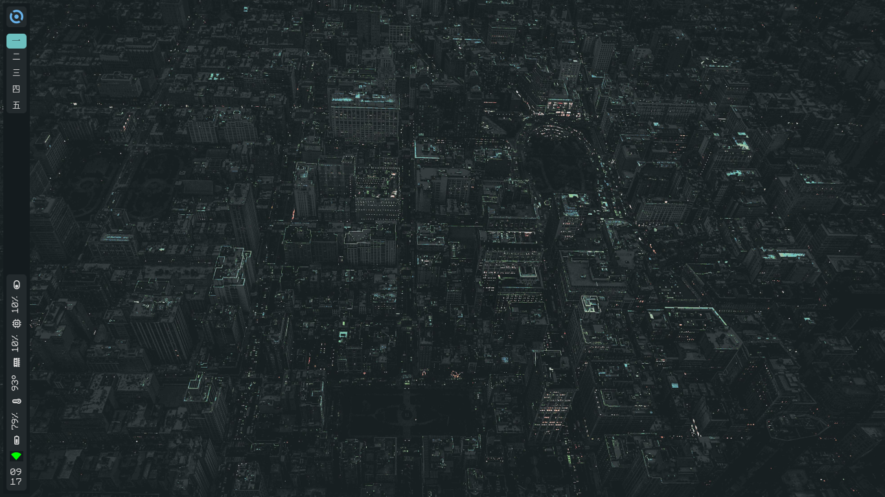

<div align="center">
 
</div> 
<h1 align="center">Everblush Dotfiles</h1> 
<h4 align="center"><i>Simple et minimaliste!</i></h4> 

## Components
- ### Main Components
- [void linux](https://voidlinux.org/)
- [swayfx](https://github.com/WillPower3309/swayfx)
- [waybar](https://github.com/Alexays/Waybar)
- [wezterm](https://wezterm.org/)
- [fish](https://fishshell.com/)
- [fish prompt](https://github.com/IlanCosman/tide)
- [firefox](https://www.mozilla.org/en-US/firefox/linux/)
- [firefox theme](https://codeberg.org/awwpotato/PotatoFox)
- [wofi](https://github.com/SimplyCEO/wofi)
- [dunst](https://github.com/dunst-project/dunst)
- [nighttab](https://github.com/zombieFox/nightTab)
- ### Terminal Tools
- [pfetch](https://github.com/dylanaraps/pfetch)
- [cbonsai](https://gitlab.com/jallbrit/cbonsai)
- [btm](https://github.com/ClementTsang/bottom)
- [neovim](https://lazy.folke.io/)
## Installation
```
Install Dependencies:
sudo xbbs-install iwd wofi waybar psmisc swayfx dunst brillo pamixer swayidle swaylock pfetch bottom wezterm neovim fish git
Disclaimer!:
Depending on your distro you might have to build some of the dependencies! Heres a list of the ones i had to build manually in Void:
- Grimshot - Screenshot utils
- Impala - iwd wifi tui
After the dependencies you should do:
1. git clone https://github.com/imrando/dotfiles
2. cp -r .dotfiles/* $HOME/.config/
3. chmod +x ~/.config/waybar/get_distro_icon.sh
4. chmod +x ~/.config/waybar/launch-waybar
5. chmod +x ~/.config/wofi/powermenu.sh
```
# Screenshots 






  
